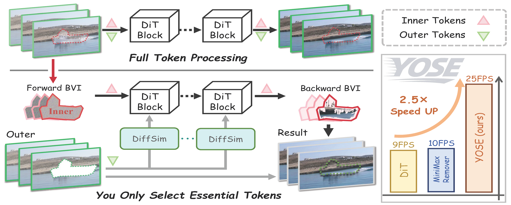
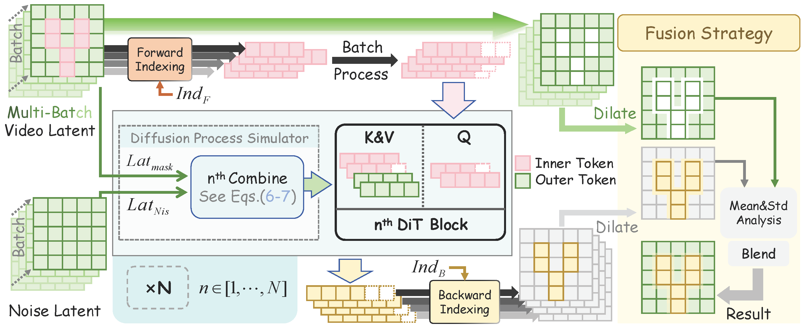
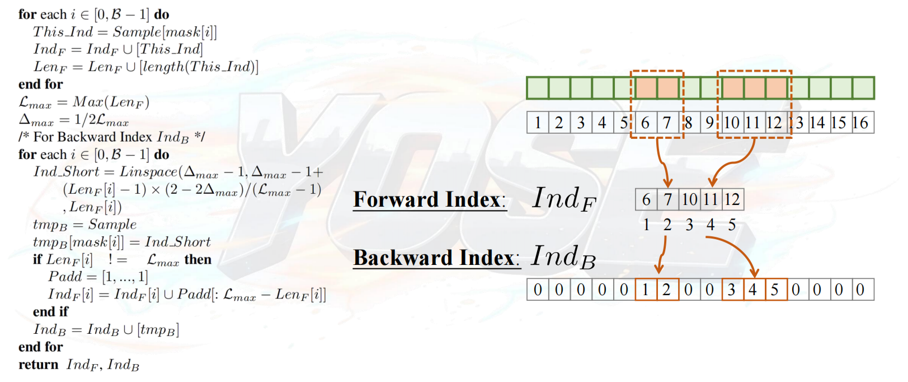

# 🧊 YOSE: You Only Select Essential Tokens for Efficient DiT-based Video Object Removal

<a href='http://arxiv.org/abs/2604.27322'></a> &nbsp;
<a href="https://huggingface.co/datasets/wcy1234567/yose-dataset"></a> &nbsp;

Due to circumstances beyond our control, this reproduction code was created by some science enthusiasts based on our paper. This is non-official PyTorch code for our CVPR26 paper.

>**YOSE: You Only Select Essential Tokens for Efficient DiT-based Video Object Removal**<br>[Chenyang Wu<sup>1</sup>](), [ Lina Lei<sup>1</sup>](), [ Fan Li<sup>2</sup>](),[Chun-Le Guo<sup>1,3,&dagger;</sup>](), [Dehong Kong<sup>2</sup>](), [Xinran Qin<sup>2</sup>](), [Zhixin Wang<sup>2</sup>](), [Mingming Cheng<sup>1,3</sup>](), [Chongyi Li<sup>1,3</sup>]() <br>
> <sup>1</sup> VCIP, CS, Nankai University,  <sup>2</sup>Huawei Noah’s Ark Lab, <sup>3</sup>NKIARI, Shenzhen Futian<br>
>  <sup>&dagger;</sup>Corresponding author.



### Introduction

Recent advances in Diffusion Transformer (DiT)-based video generation technologies have shown impressive results for video object removal.  However, these methods still suffer from substantial inference latency. For instance, although MiniMax Remover achieves state-of-the-art visual quality, it operates at only around 10 FPS, primarily due to dense computations over the entire spatiotemporal token space—even when only a small masked region actually requires processing. In this paper, we present **YOSE** — **Y**ou **O**nly **S**elect **E**ssential Tokens, an efficient fine-tuning framework. YOSE introduces two key components: Batch Variable-length Indexing (BVI) and Diffusion Process Simulator (DiffSim) Module.  BVI is a differentiable dynamic indexing operator that adaptively selects essential tokens based on mask information, enabling variable-length token processing across samples. DiffSim provides a diffusion process approximation mechanism for unmasked tokens, which simulates the influence of unmasked regions within DiT self-attention to maintain semantic consistency for masked tokens. With these designs, YOSE achieves mask-aware acceleration, where the inference time scales approximately linearly with the masked regions — in contrast to full-token diffusion methods whose computation remains constant regardless of the mask size. Extensive experiments demonstrate that YOSE achieves up to 2.5X speedup in 70% of cases while maintaining visual quality comparable to the baseline.

[Note]: 



## :newspaper: News
- [x] Release the inference code reproduced by research enthusiasts.
- [x] Release the training code reproduced by research enthusiasts.

## :sparkles: Key Algorithm Implementation 
### Batch Variable-length Indexing ([BVI](https://github.com/Wucy0519/YOSE-CVPR26/blob/main/models/wcy_kit.py#L301))

BVI is a general-purpose algorithm; You can use it for all DiT-based tasks involving local editing, like this
```python
from models.wcy_kit import get_index_grad_batch, index1d_batch
input = torch.randn([4, 7800, 1536]).cuda()
masks = torch.randn([4, 7800]).cuda()

forward_index, backward_index = get_index_grad_batch(masks)     # when the value of the element >= 0.5, this element is selected;
short_ = index1d_batch(input, forward_index)                    # Forward BVI
long_  = index1d_batch(short_, backward_index)                  # Backward BVI
```

### Diffusion Process Simulator ([DiffSim](https://github.com/Wucy0519/YOSE-CVPR26/blob/main/models/transformer_yose.py#L24))
It's very simple and easy to implement; you can easily find it in our code.

## :wrench: Dependencies and Installation
This code runs in the same environment as the minimax-remover, which you can find in [here](https://github.com/zibojia/MiniMax-Remover).

## :robot: Training and Evaluation

### Evaluation
Download the pretrained model of Minimax Remover from <a href="https://huggingface.co/spaces/zibojia/MiniMax-Remover"></a>.

[Tips]: The pretrained model of Minimax Remover downloaded from HuggingFace does not include `model_index.json`; we recommend downloading it from the official wan2.1 code repository ([here](https://huggingface.co/Wan-AI/Wan2.1-T2V-1.3B-Diffusers/blob/main/model_index.json)).

Download our eval dataset [ YouTuBe-VOS ] and [ DAVIS ] from: <a href="https://huggingface.co/datasets/wcy1234567/yose-dataset"></a>

Configure the following path information in `test.py`
```python
wan_path = r"/home/wcy/checkpoint/MiniMax-Remover"                     # Minimax-Remover pretrained model
data_path = r"/home/wcy/datas/dataset_yose/video_dataset/davis"        # eval dataset
save_path = r"/home/wcy/datas/save/result-yose"                        # the save path of yose's results
```
and run
```shell
python test.py
```

### Training
Firstly, you can download the video dataset from VPData <a href='https://huggingface.co/datasets/TencentARC/VPData'></a> (proposed by VideoPainter), which can also be found in ([here](https://github.com/TencentARC/VideoPainter)).
Only video is needed, and  70,000 samples are enough.
run
```shell
accelerate launch \ 
    --mixed_precision="bf16" \ 
    train.py \ 
    --dataset_path="/path/to/your/dataset" \ 
    --pretrained_model_name_or_path="/path/to/the/pretrained/model/of/minimax-remover" \ 
    --batch_size=32 \ 
    --dataloader_num_workers=4 \ 
    --gradient_accumulation_steps=1 \ 
    --output_dir="/path/to/your/save/dir" \ 
    --logging_dir="logs/" \ 
    --num_train_epochs=1000 \ 
    --learning_rate=5e-5 \ 
    --lr_scheduler="constant" \ 
    --mixed_precision=bf16 \ 
    --checkpointing_steps=2000 \ 
    --validating_steps=100 \ 
    --use_gradient_checkpointing
```

## :book: Citation

```
@article{wu2026yose,
  title={YOSE: You Only Select Essential Tokens for Efficient DiT-based Video Object Removal},
  author={Wu, Chenyang and Lei, Lina and Li, Fan and Guo, Chun-Le and Kong, Dehong and Qin, Xinran and Wang, Zhixin and Cheng, Ming-Ming and Li, Chongyi},
  journal={arXiv preprint arXiv:2604.27322},
  year={2026}
}
```

## :scroll: License

Non-commercial Project. This project is licensed under the Pi-Lab License 1.0 - see the [LICENSE](LICENSE) file for details.

## :postbox: Contact

For technical questions and commercial licensing, please contact `chenyangwu[AT]mail.nankai.edu.cn`.

## :handshake: Acknowledgement

This repository borrows heavily from [Diffuers](https://github.com/huggingface/diffusers), [Minimax Remover](https://github.com/zibojia/MiniMax-Remover) and [VideoPainter](https://github.com/TencentARC/VideoPainter).<br/>

We also thank all of our contributors.

<a href="https://github.com/Wucy0519/YOSE-CVPR26/graphs/contributors">
  
</a>
